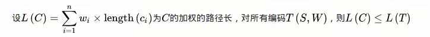

## compish   
`This is use haffman`  
  
#### what the haffman ?

haffman 是由带权值的N个叶子节点构成的一颗树，若树的带权路径长度达到最小，称这样的二叉树为最优二叉树，哈夫曼树是带权路径长度最短的树  
</img>

haffman coding  是由变长编码表对源符号进行编码，其中变长编码表是通过评估符号出现频率计算的，出现的概率越高的符号使用更短的编码,反之出现的越少编码越长  

##### How to build haffman coding

1. 广义  
	- 给定  
	一组符号(Symbol) 和 其对应的权重值(weight),其权重通常表示称概率(%)
	- 预知  
	一组二元的前置码，其二元码的长度为最短
2. 狭义  
	- 输入  
	<u>符号集合S={S1,S2.... Sn},其集合的大小为n。  
	权重集合W = {w1,w2 .... wn},其w集合不为负数，且wi = weight(si),1 <= i <= n.</u>    
 	- 输出   
	一组编号C(S,W) = {c1,c2 .... cn},其c是集合的一组二进制数据且ci为si相对应的编码，1 <= i <= n  
	- 目标  
	</img>  
3. 示例  
haffman tree 常处理字符编写工作，根据数组资料中的符号出现的频率高低，决定如何给符号编码。如果符号出现的频率越高，则给符号的编码越短，相反符号的号码越长。
###### 演算过程  
进行haffman coding 之前，先创建一个haffman tree.  
1. 将每个符号依照频率由小到大排序，最小在左  
</img>  
2. 每个字母都代表一个终端节点，比较F.O.G.E.T 六个字母代表每个字母的出现的频率，将最小的字母频率相加合成一个新的节点。
⒉每个字母都代表一个终端节点（叶节点），比较F.O.R.G.E.T六个字母中每个字母的出现频率，将最小的两个字母频率相加合成一个新的节点。如Fig.
2.  所示，发现F与O的频率最小，故相加2+3=5。  
⒊ 比较5.R.G.E.T，发现R与G的频率最小，故相加4+4=8。  
⒋  比较5.8.E.T，发现5与E的频率最小，故相加5+5=10。  
⒌  比较8.10.T，发现8与T的频率最小，故相加8+7=15。  
⒍  最后剩10.15，没有可以比较的对象，相加10+15=25。   
最后产出树装图
- 1. 给haffman 树的所有左链接‘0’ 与又链接 ‘1’。   
- 2. 从树跟至树叶依序记录所有字母的编码  
>> Variable 

@<a herf="https://github.com/denstiny">My github</a>
